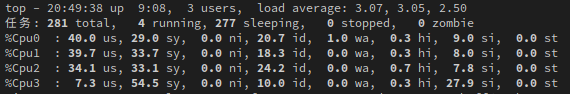

# 介绍

RabbitServer是一个运行于Linux平台的HTTP服务器，采用C++14编写，目前支持处理HTTP/1.1的静态GET，HEAD，OPTIONS请求以及FastCGI请求。

# 特点
1. Reactor风格
2. 使用epoll边缘触发的IO多路复用技术
3. 使用独创的**无锁事件分发模型**
4. 支持长连接，采用**Timerfd**支持以事件驱动的多轮盘**Timewheel**，以实现应用层TCP保活机制
5. 基于**双缓冲区技术**与细粒度锁实现的**线程安全hashmap**实现了简单的异步日志系统
6. 大量利用析构函数，智能指针等手段实现**RAII**机制，无内存泄露
7. 实现基于状态机的HTTP解析
8. 实现**Fastcgi**协议与后台运行的php-fpm进行通信
9. 使用非阻塞connect实现简单客户端,支持**用户态重连**
10. 实现**安全高效**的用户态**InputBuffer**与**Ouputbuffer**，以保证服务器的高可用性
11. 解决**busy_loop**问题
12. 为保证高性能在发送文件时使用**零拷贝**技术
13. 利用**绑核机制**最大化CPU缓存命中率
14. 大量应用constexper，noexcept，__attribute__等机制以增加代码的优化潜能
15. 整个项目各个子版块设计优良且子版块之间松耦合，使得维护与优化更为简洁
16. 运行简单且稳定，直接在后台执行即可，且就测试而言相比于Nginx与Apache波峰不明显，即运行非常稳定

# 安装与运行
运行Rabbitserver之前首先要确保你的机器已经正确配置了Cmake，你可以在软件源中下载并安装Cmake。
```
# debian && ubuntu
sudo apt-get install cmake

# arch
sudo pacman -S cmake
```

确保你的机器安装GCC，并支持c++14（最低6.0版本）你可以点击[这里](https://gcc.gnu.org/projects/cxx-status.html)查看GCC对C++特性的支持。

```
# arch
sudo pacman -S gcc
```
其他版本Linux比较繁琐，具体操作点击
[传送门](https://blog.csdn.net/f2157120/article/details/102830685?ops_request_misc=%257B%2522request%255Fid%2522%253A%2522160785007719724813235689%2522%252C%2522scm%2522%253A%252220140713.130102334..%2522%257D&request_id=160785007719724813235689&biz_id=0&utm_medium=distribute.pc_search_result.none-task-blog-2~all~sobaiduend~default-4-102830685.first_rank_v2_pc_rank_v29&utm_term=linux%E5%AE%89%E8%A3%85gcc&spm=1018.2118.3001.4449)


最后确保你的机器已经预安装了boost库。
```
wget http://sourceforge.net/projects/boost/files/boost/1.54.0/boost_1_54_0.tar.gz
tar -xzvf boost_1_54_0.tar.gz
cd boost_1_54_0
./bootstrap.sh --prefix=/usr/local
sudo ./b2 install --with=all
```

因为加入了性能分析，所以需要引入[gperftools](https://github.com/gperftools/gperftools)工具。
```
# arch 
sudo pacman -S gperftools
# 其他版本
./autogen.sh
./configure
make -j8
sudo make install
ldconfig 刷新动态库文件
```

最后性能测试如果需要生成pdf的话需要安装Graphviz。
```
# debian && ubuntu
sudo apt-get install graphviz graphviz-doc

# arch
sudo pacman -S graphviz
```

以上步骤完成以后我们就可以运行RabbitServer了。
```
mkdir build;
cd build;
cmake ..;
make;
./Web_Server;
```
# 目录结构说明

```
.
├── base            // 基础类与配置
├── client          // 客户端相关
├── FastCgi         // FastCgi相关
├── http
│   ├── provider    // 提供http响应报文
│   └── other       // 解析http请求报文
├── log             // 异步日志库
├── net             // 对于基础设施的封装
├── server          // 服务器主体相关
└── tool            // 向其他目录提供耦合子模块的封装
```

# 测试环境
| 环境名称 | 值 | 
:-----:|:-----:|
系统|5.9.6-arch1-1|
处理器|4 x Intel® Core i5-7200U CPU @ 2.50GHz |
L1 Cache|32KB|
逻辑核数|4|
系统负载|3.07, 2.11, 1.99|
内存占用|5700MB(used)/1824MB(buff/cache)/215MB(free)
Swap |4012MB(used)/1014MB(avail mem)/4179MB(free)
Cmake版本|3.18.4|
GCC版本|10.2.0|

## 测试项目 ApacheBench v2.3

```
对比对象: Nginx 1.18.0-2 / Apache Httpd/2.4.46-3
```

测试所使用的命令：
```
ab -n 100000 -c 100  127.0.0.1:8888/
```

每秒完成的请求数（RPS）：
| 服务器名称 | 值/sec| 
:-----:|:-----:|
|Nginx| 21126.26 
|RabbitServer| 19284.88
|Apache| 17545.28

每个请求花费的时间：
| 服务器名称 | 值/ms| 
:-----:|:-----:|
|Nginx| 0.047
|RabbitServer| 0.052
|Apache| 0.057


百分比请求完成时间(连接时长 + 服务器处理时长 + 一个RTT)：
| 百分比 | Nginx/ms | RabbitServer/ms | Apache/ms | 
:-----:|:-----:|:-----:|:-----:|
|50%| 5 | 5 | 6 |
|66%| 5 | 5 | 6
|75%| 5 | 5 | 6
|80%| 5 | 5 | 6
|90%| 6 | 6 | 6
|95%| 6 | 6 | 7
|98%| 6 | 8 | 8
|99%| 7 | 11 | 11
|100%| 16 | 20 | 43

测试所使用的命令：
```
ab -n 1000000 -c 1000 -r 127.0.0.1:8888/
```
[添加-r参数的原因](https://www.cnblogs.com/archoncap/p/5883723.html)

每秒完成的请求数（RPS）：
| 服务器名称 | 值/sec| 
:-----:|:-----:|
|Nginx| 17547.80 
|RabbitServer| 17825.56
|Apache| 14863.09 

每个请求花费的时间：
| 服务器名称 | 值/ms| 
:-----:|:-----:|
|Nginx| 0.057 
|RabbitServer| 0.056
|Apache| 0.067


百分比请求完成时间(连接时长 + 服务器处理时长 + 一个RTT)：
| 百分比 | Nginx/ms | RabbitServer/ms | Apache/ms | 
:-----:|:-----:|:-----:|:-----:|
|50%| 20 | 52 | 48
|66%| 23 | 56 | 51
|75%| 24 | 57 | 54
|80%| 25 | 58 | 55
|90%| 27 | 64 | 62
|95%| 28 | 69 | 70
|98%| 27 | 73 | 250
|99%| 29 | 86 | 1056
|100%| 55274 | 1162 | 15537


# 总结
## 从性能分析角度
就性能分析结果来看，RabbitServer的架构是没有大问题的，因为最为耗CPU时长的函数就是send，sendfile，close这些正常的大消耗系统调用，正常的逻辑处理其实没有什么特殊的地方。但是有一个地方令人诧异，就是unique_ptr的各种操作耗时，占到了整个项目运行时CPU占有率的**百分之十二**以上，这是令人十分震惊的，因为在1000线程时RabbitServer的RPS已经超过了Nginx，而在100线程时比Nginx低**百分之八**左右，这是一个后面要着重思考的地方，其他的地方就性能分析图来看没有什么问题。

当然我选择的架构不是最优的，就目前来说还是ReusePort加多线程（多进程）处理的方法更为优秀，不是因为单点的accept瓶颈问题，而是因为内核可以自动做到负载均衡。单线程accept多线程处理的模型做起负载均衡来就比较麻烦，尤其是支持长连接的时候，这是一个后期可以改进的点，目前已经有了大概的构思。

还有本来向在文件的代理类部分引入一层类slab层，这样静态的资源就免去了不停的打开关闭，但分析以后发现文件的操作并没有消耗太长的时间，所以遵循二八法则，暂时没有这样做。

## 从CPU负载来看
首先来看看RabbitServer在运行时的CPU负载情况：

这个情况很好理解，也符合预期，因为ApacheBench使用的是HTTP 1.0，所以只支持短连接，且请求内容都一样，所以每个核的负载其实很平均，且accept线程相对来说负载较轻，所以CPU3负载较低。这里我尝试过把工作线程的数量提高一点，但是可见的工作线程一定会与accept线程竞争，为了减轻accept线程破坏多个工作线程缓存的有效性，我引入了绑核机制，使得accept线程只会和一个工作线程竞争，因为就性能分析图可以看出简单的http请求处理其实是计算密集型，所以缓存的失效比想象的更严重，加工作线程这件事直接使得整体的RQS下降了百分之十八。

所以这也可以看出这样的模型说起来会有accept的单点问题，但实际并没有，可见的，至少再扩展十几个核这个accept线程也不会超载。

## 后续可以修改的地方
1. 搞清楚以后替换unique_ptr
2. FastCgi的请求目前还是同步，最近时间太紧，有时间可以修改为异步，目前已经构思了两种方案。
3. HEAD，OPTIONS还没加呢，别忘了。